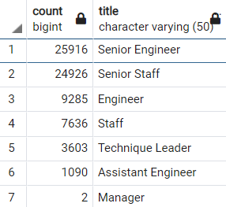

# Pewlett-Hackard-Analysis
SQL Project

## Overview
### Background
Pewlett Hackard is a large company who has several employees retiring soon. This will open up large amount of positions in various departments. Bobb who is an HR Analysts have been asked to find the list of employees who are going to retire soon. This will help the company to identify which postions would need to be filled. The company need to plan ahead so that they can prepare and train the new joinees on time and not impact the work. 

### Purpose
Bobb was asked to analyze a bunch of csv files and share his analysis on the retirement data.
Following csv files were given to Bobb
- [Department.csv](Data/departments.csv)
- [Employee.csv](Data/employees.csv)
- [Department_Employee.csv](Data/dept_emp.csv)
- [Department_Manager.csv](Data/dept_manager.csv)
- [Employee Salary.csv](Data/salaries.csv)
- [Employee Titles.csv](Data/titles.csv)

The analysis should cover the following results :
1) [Find the list of employees who are going to retire soon](#List-of-Retiring-Employee)
2) [Find retiring employees titles to know what positions need to be filled](#List-Of-Employees-With-Retirement-Titles)
3) [Find unique titles of the retiring employees](#List-of-Unique-Retiring-Titles)
4) [Count of Retiring titles](#Count-of-Retiring-Titles)
5) [Find the eligible retiring employees for retirement package](#Mentorship-Eligible-Employees)

## Design
Bobb needed a database to store the csv files. Here a SQL database is created and all different tables were created using the [schema script](
## Results
### List of Retiring Employees
1) In order to find the list employees we have to fetch data from Employee table which has birthdate in between '1952-01-01' AND '1955-12-31'

``` sql
  drop table if exists Retirement_titles
  SELECT distinct e.emp_no, e.first_name, e.last_name
  from employees e
  WHERE e.birth_date BETWEEN '1952-01-01' AND '1955-12-31'
  order by e.emp_no;
```

### List Of Employees With Retirement Titles

2) Then we need to join to the Titles table to get those employees current titles

``` sql
  drop table if exists Retirement_titles;
  SELECT distinct e.emp_no, e.first_name, e.last_name, t.title, t.from_date, t.to_date 
  INTO Retirement_titles
  from employees e
  Left Join titles t on t.emp_no = e.emp_no
  WHERE e.birth_date BETWEEN '1952-01-01' AND '1955-12-31'
  order by e.emp_no;
```
The Retirement_titles data is exported to [Retirement_titles.csv](Data/Retirement_titles.csv)

### List of Unique Retiring Titles 

3) Run a query on the new Retirement_titles table to find the unique titles

``` sql
  drop table if exists Unique_titles;
  Select  distinct on (emp_no) emp_no, first_name, last_name, title
  into Unique_titles
  from Retirement_titles
  WHERE to_date = ('9999-01-01')
  order by emp_no, to_date desc ;
```
The Unique_titles data is exported to [Unique_titles.csv](Data/Unique_titles.csv)

### Count of Retiring Titles

4) To fetch how many employees are retiring for the unique retiring titles - first need to group the data on titles
5) then in select count the titles with the title name as next field.

``` sql
  drop table if exists retiring_titles;
  Select   count(title),title
  into retiring_titles
  from Unique_titles
  group by title 
  order by count(title) desc;
```
The retiring_titles data is exported to [retiring_titles.csv](Data/Retiring_titles.csv)

### Mentorship Eligible Employees

To find the list of eligible employees for mentorship program
1) first we need to fetch employees with birthdate between '1965-01-01' AND '1965-12-31'
2) then join the dept_emp table to check on end date as '9999-01-01'
3) then join to the titles to get the title of the employee
4) Order the data based on employee number
5) display empno, first name, last name, title, employment start date, employment end data

``` sql
  --Mentorship eligible employees-
  drop table if exists mentorship_eligibility;
  SELECT distinct on (e.emp_no) e.emp_no, e.first_name, e.last_name, t.title, de.from_date, de.to_date 
  INTO mentorship_eligibility
  from employees e
  Left Join titles t on t.emp_no = e.emp_no
  Left Join dept_emp de on de.emp_no = e.emp_no 
  WHERE e.birth_date BETWEEN '1965-01-01' AND '1965-12-31' AND de.to_date ='9999-01-01'
  order by e.emp_no
```
The mentorship_eligibility data is exported to [mentorship_eligibility.csv](Data/Mentorship_eligibility.csv)

## Summary
### How many roles will need to be filled as the "silver tsunami" begins to make an impact?
Pewlett Hackard has **300024** total of number of Employees. Total number of Employees that are going to retire is **72458**. 
This means approx **24%** of the employees will be retired soon. The company needs to take immediate actions and run a hiring drive so that they get enough time to train and knowledge transfer from experienced to new employees.

Below image shows the which titles are retiring 


### Are there enough qualified, retirement-ready employees in the departments to mentor the next generation of Pewlett Hackard employees?
The number of employees retiring are **72458** , where as the number of employees eligible for mentorship program are **1549**. This means the eligible employees are almost **2.14%** less. 
In order to fill the next generation, here are two recommendations
- Increase the eligibility criteria of Mentorship Program
- Hire skilled candidates from outside of the company 
